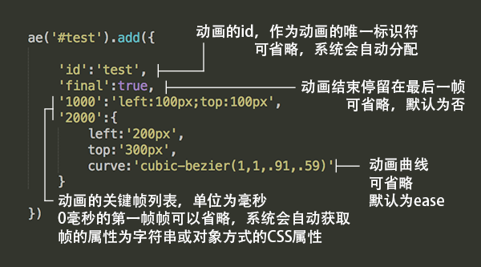

#欢迎使用AnimateEasy.js！

##简介
AnimateEasy.js是一个通过javascript来实现CSS3动画的js库 
它小巧的同时使用非常方便并且功能强大，如果你在为以下问题烦恼，那么它将是你的不二选择！

 - 对编写CSS3动画的大量的冗余编写工作感到不满
 - 对CSS3动画极差的阅读性感到不满
 - 想在CSS3动画中加入变量而无法实现（比如说动态获取窗口宽度创建动画）
 - 想用最短的时间做最多的事情

##API
AnimateEasy.js的设计理念让它的操作变得非常简单 
你只需要不到5分钟就能完全学会它！

#####选择器
	ae(element)
	ae(nodelist)
	ae('div')
	ae('#id')
	ae('.class')
	ae('[href]')
	...
没错，它和jQuery的选择器语法非常相似，并做了性能上的优化，比jQuery的选择器更轻量更快 
推荐直接传入DOM对象或者使用id或class选择器来达到最佳性能

#####方法
	ae('#test').add(obj) //添加动画，参数为一个包含了动画关键帧的对象，语法在后面
	ae('#test').play(id,fn,fn2); //播放动画，可选参数分别为: 动画的id(在.add中添加)、
								 //动画完成后执行的函数、每一个关键帧完成后执行的函数
	ae('#test').stop(id); //停止动画，可选参数为动画的id(在.add中添加)
	ae('#test').pause() //暂停动画
	ae('#test').run() //继续动画
.add()是它的核心方法，作用是为选择的对象添加动画。 
你只需要向它传入一个对象，对象的详细语法如下图所示： 

所以省略到最后你的代码可能只是这样的： 

	ae('#test').add({ 1000:'left:100px' })
	...
	ae('#test').play()
	
是不是很方便？

#####链式操作
当然和jQuery一样你可以用链式操作写出更优雅的代码

	ae('#test').add({ 1000:'left:100px' }).play()

##小贴士
从性能的角度考虑，作者把添加动画和播放动画的功能拆成了两个函数 
所以当你需要大量添加动画的时候请预先添加动画再播放以达到最佳性能  

最后再次感谢您的使用和观看 
如果对本库有什么建议、发现了什么BUG、或者想和作者交流一下技术和人生之类的 
请联系作者邮箱：ttrysama@hotmail.com